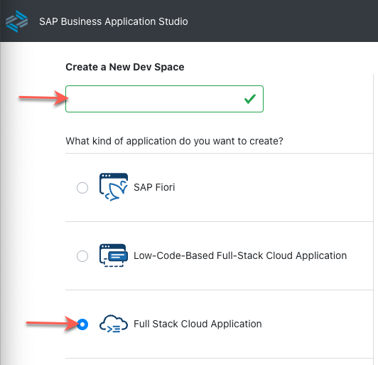
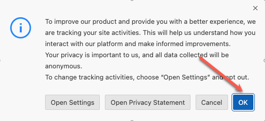

# Getting Started - Setting up your Development Environment

As a particpant of the hands-on, you should already be setup with access to the SAP Business Application Studio landscape below which you can use as your development environment.

## Accessing SAP Business Application Studio

Navigate to https://lcapteched.eu10.build.cloud.sap/lobby

**NOTE: BAS AI is only supported on Chrome. Please ensure you use the Chrome Browser.** 

## Accessing the Dev Space Manager

On the SAP Build landing page, click button **Switch Product** in the top right corner and select **Dev Space Manager**. 

## Creating the Development Space

Enter a name for your development space and select application profile Full Stack Cloud Application.

In the lower right corner of the page press button Create Dev Space.  

## Opening the Development Space

Make sure your development space has status running. If stopped, click the start button.  

Once running, click on the development space name to open it. This can take some time. 

Click **OK** in the popup window to accept the tracking settings in the newly created dev space.

## Open your project folder

Open the explorer icon from the left hand side:

And select the **Open Folder** button

Select the **projects** folder from the drop down

Click **OK** and your window will reload

## Summary

With the setup procedure done, you now have completed:

- Access to SAP Business Application Studio
- Creation of your development space

Continue to - [Exercise 1 - Generate an SAP Fiori app from business requirements](../ex1/README.md)
