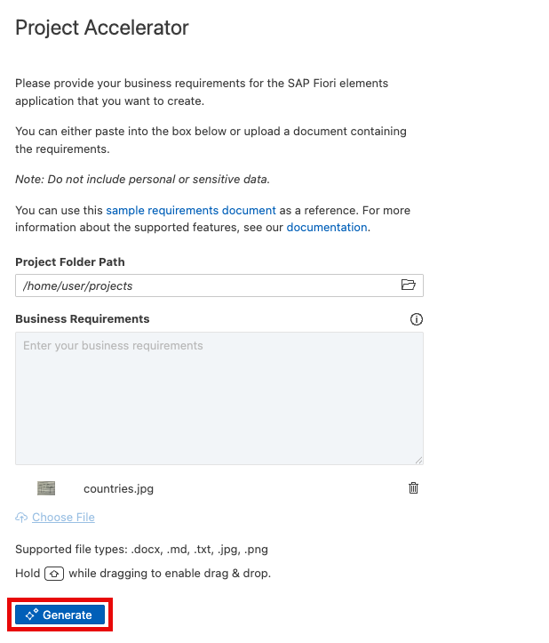

#  Exercise 2 - Generate an SAP Fiori app from an image

In this exercise, we will create a number of SAP Fiori apps, but instead of using a text document as input, we will use images of the applications that we want to create.

## Exercise 2.1 Downloading the sample images into SAP Business Application Studio

Copy the repository link below:

```
https://github.com/ianquigley-sap/ai-image-samples
```

From the menu select **View -> Command Palette**.


Search for command **git clone** and select it.


Paste the repository link into the input field and hit enter.

Choose the projects folder for the repository location and click **Select as Repository Destination**.


Click **Cancel** to see the repository added under **projects** in the current workspace.


## Exercise 2.2 Launching the SAP Fiori tools AI Project Accelerator with image input

Click the **SAP Fiori** icon in the left hand side panel.\
Similar to exercise 1, click **Launch Project Accelerator** (you can close the **Application Modeler** and **Information** sections):


Click the **Choose file** link.


Select the **countries.jpg** file from the **ai-image-samples** folder.


A thumbnail of the image should appear in the input box. Click **Generate** to start generating the application directly from the image.



The application will start generating, give it some time.


## Exercise 2.3 Previewing the generated application

After generation, the **Application Info** page should open automatically. Click the **Preview Application** button to launch a preview of the application.


Select the watch script from the Preview Options dropdown when prompted.


You may see a message in the terminal stating that the port is already in use (from previewing our application from exercise 1), click **Return/Enter** to use any other port for preview.


The application should launch in a new browser tab. Click **Go** to see the sample data that the AI has created.


## Summary

You've now successfully generated a SAP Fiori app using a sketch of the application you'd like to generate.

Continue to - [Exercise 3 -  Generate and enhance an app](../ex3/README.md)
