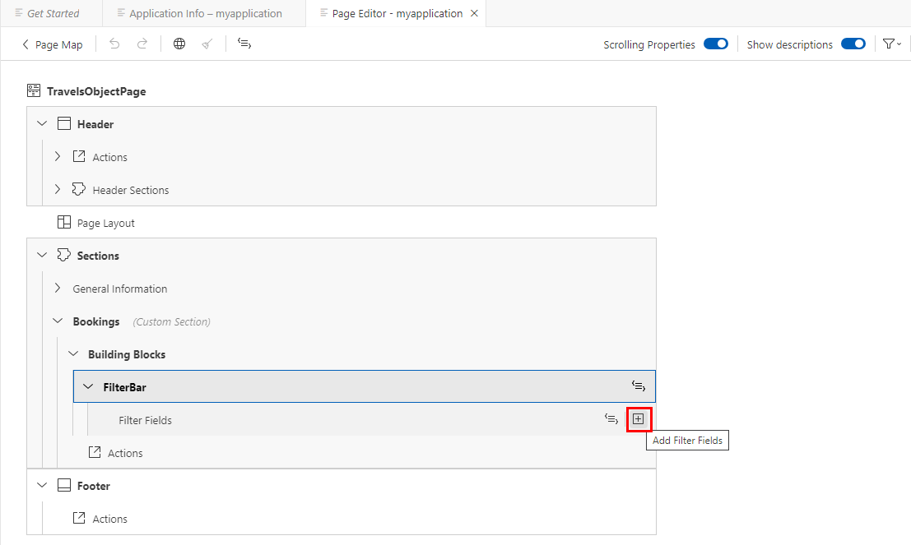
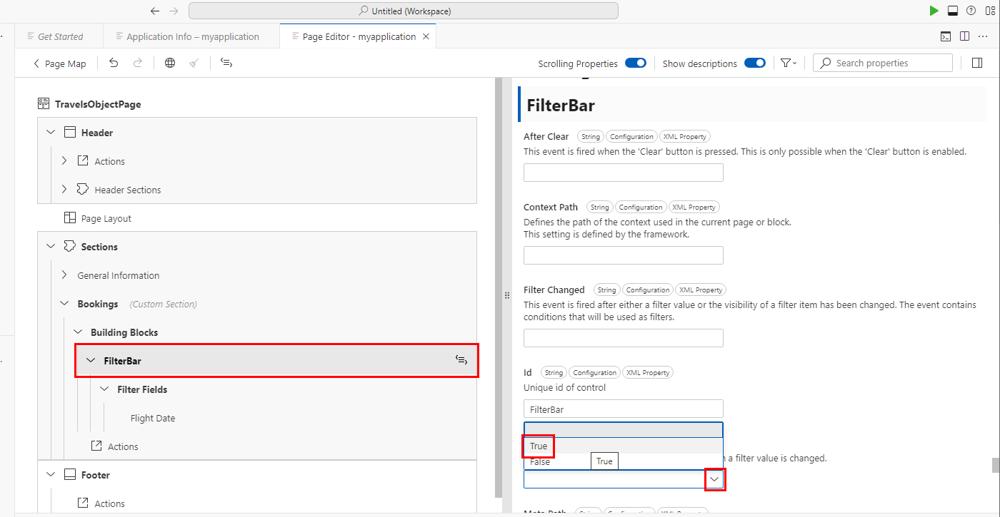

#  Exercise 3 - Generate and enhance an app


In this exercise we will put your learning from the other exercises to the test! You will re-use your skills of generating a Fiori app from a picture, but this time we will create AI generated mock data and enhance the app with the flexible programming model.

Please be aware that you need to complete: [Exercise 0 - Getting Started - Setting up your Development Environment
](../ex0/README.md) and [Exercise 2.1 - Generate an SAP Fiori app from an image](../ex2/README.md)  before you can start Exercise 3.

## Exercise 3.1 Generate your app

Navigate to you explorer in the business application studio and look for the **TravelScenario.png** picture. Click on the picture to see the preview.


The Preview should look like this:


1. Next, navigate to **SAP Fiori** in your Business Application Studio menu on the left side.
1. Click on **Launch Project Accelerator**
1. Click on **Choose file**
1. Select the **TravelScenario.png** from the drop-down.


Click **Generate**


Once the app has been successfully generated
1. A page should open named **Application Information**
2. Click **Preview Application**.


Select the **watch** option when prompted


The preview of the newly generated app should look like the following picture.


## Exercise 3.2 Enhance your app

As a next step we want to enhance our AI generated app. To do this switch back from your **Preview** tab in your browser to your **Business Application Studio** tab again.

1. Go to the **Application Information** page
2. Click on **Open Page Map**


Now you can see the page map for our AI generated Travel app. The app consists of a list report and an object page.

Before we start enhancing the app, please open the [SAP Fiori Development Portal](https://ui5.sap.com/1.141.0/test-resources/sap/fe/core/fpmExplorer/index.html#/) in a new browser tab. This portal serves as your comprehensive reference guide for building SAP Fiori applications.
Take a few minutes to explore the available standard floorplans and building blocks for SAP Fiori elements applications. Pay particular attention to the List Report and Object Page floorplans, as these are the foundation of our generated travel app. Familiarize yourself with their features and extension points, as we'll be using several of these capabilities in the following steps to enhance our application.


Please check if you can see the **Advanced features are enabled (Experimental)** sign up top. If this is the case, press the edit button on the list report.

**Note:** If your generated application's page map does not look like this, consider re-generating the application.


As the next step, we want to add an additional column that indicates whether it is a business flight, and another one showing the flight destination.\
Please find the columns section and press the **Add column** button.


Now we want to select **Add Basic Columns** from the drop-down menu.


Please open up the dropdown.


In the input field, type in **Business** and set the checkmark on the left hand side radio box.


1. Now click on **String** on the right hand side.
2. Select **Boolean**


Click **Add**.


Now we want to add a second column. Please repeat pressing the **add column** button the right hand side again.


Open up the dropdown again.


1. In the input field, type in **Destination** and set the checkmark on the left hand side radio box. This time we want to leave the selection on the right hand side on **String**.
2. Click on **Add**


In the Columns section you now can see our newly added column (Business & Destination). Now we want to move to the middle on the list. To do so click on the up arrow shown in the picture.


Once this is done, we want to preview the app again to see the newly created columns in action. Switch to your **preview** tab in your browser and reload the tab with CTRL+R (Windows) or COMMAND+R (Mac). This will reload the app and reveal the new columns Business and Destination.


## Exercise 3.3 Use Ai to refine Test Data

If you successfully previewed the two new columns (Business and Destination). We can now press the **Use Ai to refine Test Data** Button. To do this switch back from your **Preview** tab in your browser to your **Business Application Studio** tab again.


Click on **Generate**


Once this is done, we want to preview the app again to see the newly created data. Switch to your preview tab in your browser and reload the tab with CTRL+R (Windows) or COMMAND+R (Mac). This will reload the app and reveal the new data for the columns Business and Destination.

You can now see your Ai Mock Data in the preview.


## Exercise 3.4 Flexible column layout

As the next step we want to switch the layout of the app to the flexible column layout. <br>

Go back to the [SAP Fiori Development Portal](https://ui5.sap.com/1.141.0/test-resources/sap/fe/core/fpmExplorer/index.html#/) and navigate to **Global Patterns > Flexible Column Layout** to get familiar with the flexible column layout pattern before implementing it in your application.


1. To have more room in the business application studio we can now close the preview.<br>
2. Now click on **Page View**


Navigate to the Flexible Column Layout on the right side. Switch on **Flexible Column Layout**. For the 2 column layout select **Mid-Expanded**.


As a next step switch to you **Preview** tab again to reload your app with: <br>
**CTRL + R (Windows)**<br>
**Command + R (Mac)** <br>
After this step click on the first item in the list to experience the flexible column layout.


Now click on the first line on the object page


## Exercise 3.5 Using the Flexible Programming Model
The available [SAP Fiori elements floorplans](https://help.sap.com/docs/SAP_FIORI_tools/17d50220bcd848aa854c9c182d65b699/2b2b12e708944d85a40d087194cc1edd.html) for OData V4 cover most business scenarios that customers encounter with SAP. In fact, SAP uses these SAP Fiori elements floorplans to create roughly 80% of new SAP S/4HANA apps.\
If these floorplans do not meet your needs, the [flexible programming model](https://ui5.sap.com/test-resources/sap/fe/core/fpmExplorer/index.html#/overview/introduction) provided by SAP Fiori elements allows to assemble your custom design by combining the available building blocks with SAPUI5 controls,\
and leverage controller extensions in order to fine-tune the behaviour of your app.

Open the [SAP Fiori Development Portal](https://ui5.sap.com/1.141.0/test-resources/sap/fe/core/fpmExplorer/index.html#/) and explore the extension points available for floorplans, especially the ones for the **Object Page** floorplan.
One extension point we want to leverage is the **custom section**. As you can see in the SAP Fiori Development Portal, you can add custom UI5 controls, for example the GeoMap control shown in the portal.


In our scenario we want to leverage the custom section extension point but will also use the building blocks **Filter Bar** and **Table**, enabling the user to set a filter on the bookings of a selected travel.

Please click on the **SAP Fiori** button in the left hand navigation


Now open the **Open Application Info** on your most recently created app. Depending if you accomplished all exercises this should be ai-created-cap 2.  .


Click on **Open Page Map**.


Click on **Configure page** for the object page. .


Press the **Delete** button  to delete section **Bookings**.


If you run into the following Error, please reload BAS: <br>
**CTRL + R (Windows)**<br>
**Command + R (Mac)** <br>


Next click on the **Add Sections**  menu item.


Click **Actions** and select .


1. Type in **Bookings** as a title.

2. Click  to generate a translatable text key.

3. Click  .


Please fill in the fields as shown below and make sure everything is entered correctly. Then click on **ADD**.


We have now successfully created a new custom section extending the app based on an XMLfragment. **Please make sure it shows (Custom Section) after Bookings. If this is not the case please reload your tab.**
We need to make sure that the browser view cache is deactivated during testing our development, so that changes applied to the xml fragment get properly updated when refreshing the UI.\
For this, we will use the watch script that has been added to file **package.json** by the app generator. The script contains additional parameter **sap-ui-xx-viewCache=false** added to the app start Url.

In the Application Modeller pane, click **Preview Application** .


Choose the second entry ->  **cds watch \--openmyapplication/webapp/index.html?sap-ui-xx-viewCache=false**


1. Switch to your preview tab in your Browser.
2. Click on the first entry of your list report to find our newly created custom section on our object page.


Switch back from your preview tab to the page editor in your Business application studio and expand custom section **Bookings**.


Now we want to add the filter bar building block to our custom section.

Before doing so, please open the [SAP Fiori Development Portal](https://ui5.sap.com/1.141.0/test-resources/sap/fe/core/fpmExplorer/index.html#/) in a new browser tab again. Navigate to **Building Blocks > Filter Bar** to get familiar with the filter bar building block before implementing it in your application.


Click button **Add** .


Select .


1. Click  to reveal the dropdown for **Value Source**.

2. Select **bookings**.


1. Click  to reveal the dropdown for **Aggregation Path**.

2. Select .\
   This ensures that the filter building block will be added at the corresponding position in the XML fragment.


Click **Add**.


We will now define a filter field to be shown in the filter bar.\
Click **Add Filter Fields** .



1. Click  to reveal the dropdown.

2. Check the radiobox for .
3. Click Add.


1. Open the filter bar properties panel by clicking entry .

2. Search for property **Live Mode** and set it to **True**.



1. Search for property **Show Clear Button** and set it to **True**.


In the page editor, click **Edit in source code**  for filter field **Flight Date** to navigate to the corresponding annotation.


For the filter field, we will now enable the usage of semantic date values, such as **Today** or **Last Week**, by applying annotation **FilterRestrictions.AllowedExpressions** as described in [the documentation](https://ui5.sap.com/#/topic/fef65d03d01a4b2baca28983a5449cf7).\
Please copy the Code snippet below and paste it on the exact position that is shown in the picture:

```
    Capabilities : {
      FilterRestrictions : {
        FilterExpressionRestrictions :
          [{
              Property : 'flightDate',
              AllowedExpressions : 'SingleRange'
          }]
      }
    }
```


Switch to your preview tab to see the latest changes to your app. If you cant see the latest changes please reload your browser window.


Switch back to your Business application studio. We will now use **Guided Development** to add a table building block.\
Guided development allows the user to walk through the steps required to implement a specific functionality in the SAP Fiori elements application.\
Click on the **SAP Fiori** icon on the left hand side panel.


Click on **Open Application Info** on your latest app.


Click on **Open Guided Development**.


Close the **Application Info** tab to free up more space in the editor.


1. Now use the search on the top right hand of the screen and type in **"Table Building Block"**
2. Click on **"Add a Table Building Block"**


**Start the guide**


1. In the first step of the guide, fill in fields **CDS File / Service / Entity** as depicted below.
2. Click Next.


In the second step of the guide, fill in the required fields as depicted below.


**Scroll down** and click **Insert Snippet**.


1. File **Bookings.fragment.xml** is opened, showing the table building block added to the defined aggregation path position. It should look like this:
```
<macros:Table id="Table" metaPath="/Travels/bookings/@com.sap.vocabularies.UI.v1.LineItem" filterBar="FilterBar" headerVisible="true" isSearchable="true" selectionMode="Single" type="ResponsiveTable" variantManagement="None"/>
```
2. Click on **Exit Guide**


Before we preview the app, open the custom section created by SAP Fiori tools. You'll see an XML tag `<Text text="Bookings"/>`. As this is just a placeholder and is not needed in our application, remove it. Also, add a class `sapUiSmallMarginBottom` to the filter bar.

Your XML fragment should now look like:
```
<core:FragmentDefinition xmlns:core="sap.ui.core" xmlns="sap.m" xmlns:macros="sap.fe.macros">
    <VBox>
        <macros:FilterBar class="sapUiSmallMarginBottom" id="FilterBar" metaPath="bookings/@com.sap.vocabularies.UI.v1.SelectionFields#filterBarMacro" liveMode="true" showClearButton="true"/>
        <macros:Table id="Table" metaPath="/Travels/bookings/@com.sap.vocabularies.UI.v1.LineItem" filterBar="FilterBar" headerVisible="true" isSearchable="true" selectionMode="Single" type="ResponsiveTable" variantManagement="None"/>
    </VBox>
</core:FragmentDefinition>
```

Switch to your preview tab to see the result. You can now specify a range in the newly added filter bar.
1. Select a travel entry in the List Report to open the travel details in the object page.
2. In the **Bookings** section, open filter field **Flight Date**, go to **Date Ranges** and select **From / To**.
3. Click **Apply**.


The filter is applied to the bookings table.


SAP Fiori elements also provides various controller extensions to fine-tune the behaviour of your app. This can be in the area of edit flows/action handling, routing, navigation, etc.  Please open the [SAP Fiori Development Portal](https://ui5.sap.com/1.141.0/test-resources/sap/fe/core/fpmExplorer/index.html#/) in a new browser tab again. Navigate to  **Floorplans > Extensions** to get familiar with the available controller extensions before implementing one in your application.


## Exercise 3.6 Adding Edit Flow Controller Extensions

Launch the **Application Information** page and click on **Open Page Map**


Click **Add Controller Extension** for the TravelsObjectPage.


Name the controller **"OPExtend"** and click **Add**.


Click **Edit in source code**  to add some custom controller configurations.

Replace the source code inside **OPExtend.controller.js** with the following code snippet:

```
sap.ui.define(
	[
		"sap/ui/core/mvc/ControllerExtension",
		"sap/m/Text",
		"sap/m/Button",
		"sap/m/MessageToast",
		"sap/m/MessageBox",
		"sap/ui/model/json/JSONModel"
	],
	function (ControllerExtension, Text, Button, MessageToast, MessageBox, JSONModel) {
		'use strict';

		return ControllerExtension.extend('managetravelfioriapp.ext.controller.OPExtend', {
			// this section allows to extend lifecycle hooks or hooks provided by Fiori elements
			override: {
				/**
				 * Called when a controller is instantiated and its View controls (if available) are already created.
				 * Can be used to modify the View before it is displayed, to bind event handlers and do other one-time initialization.
				 * @memberOf managetravelfioriapp.ext.controller.OPExtend
				 */
				onInit: function () {
					// Sample data
					let data = {
						text: "",
						formVisible: false
					};
					let dialogModel = new JSONModel(data);
					this.getView().setModel(dialogModel, "dialog");
				},
				editFlow: {
					onBeforeEdit: function (mParameters) {
						if (mParameters?.context.getProperty("priceUSD") > 1000) {
							return this.openDialog("Take special care on travels with a total price above 1000 USD. \n\nDo you want to continue to edit?", true);
						}
					},
					onBeforeSave: function (mParameters) {
						return mParameters?.context.requestProperty(["priceUSD"]).then((result) => {
							return result[0] > 1000 ? this.openDialog("Take special care on travels with a total price above 1000 USD. \n\nDo you want to continue to save?", false) : null;
						});
					}
				}
			},
			openDialog: function (text, formVisible, fnAction) {
				return new Promise(
					function (resolve, reject) {
						let dialogModel = this.getView().getModel("dialog"),
							data = dialogModel.getData();
						data.text = text;
						data.formVisible = formVisible ? formVisible : false;
						dialogModel.setData(data);
						//use building blocks in an XML fragment using the loadFragment method from the SAP Fiori elements ExtensionAPI
						this.base
							.getExtensionAPI()
							.loadFragment({
								name: "managetravelfioriapp.ext.fragment.Dialog",
								controller: this
							})
							.then(function (approveDialog) {
								//Dialog Continue button
								approveDialog.getBeginButton().attachPress(function () {
									approveDialog.close();
									if (fnAction) {
										fnAction();
									}
									resolve(null);
								});
								//Dialog Cancel button
								approveDialog.getEndButton().attachPress(function () {
									approveDialog.close().destroy();
									reject(null);
								});
								//consider dialog closing with Escape
								approveDialog.attachAfterClose(function () {
									approveDialog.destroy();
									reject(null);
								});
								approveDialog.open();
							});
					}.bind(this)
				);
			}
		});
	});
```


Now it's time to create the dialog fragment that is referenced in our controller extension code. Navigate to the **fragment** folder inside the **Explorer**. Right click and click **New File...**


Name the file **"Dialog.fragment.xml"**. Open the file and paste in the following code snippet:

```
<core:FragmentDefinition
	xmlns="sap.m"
	xmlns:macros="sap.fe.macros"
	xmlns:l="sap.ui.layout"
	xmlns:f="sap.ui.layout.form"
	xmlns:core="sap.ui.core"
>
	<Dialog title="Confirmation" id="confirmationDialog" contentWidth="28rem">
		<content>
			<Text
				id="message"
				text="{dialog>/text}"
				class="sapUiSmallMarginTopBottom sapUiSmallMarginBeginEnd"
			/>
			<f:Form visible="{dialog>/formVisible}" id="form">
				<f:layout>
					<f:ColumnLayout columnsXL="2" columnsL="2" columnsM="2" id="columnLayout" />
				</f:layout>
				<f:formContainers>
					<f:FormContainer id="formContainer">
						<f:formElements>
							<macros:FormElement metaPath="priceUSD" id="formElement" />
						</f:formElements>
					</f:FormContainer>
				</f:formContainers>
			</f:Form>
		</content>
		<beginButton>
			<Button id="continue" text="Continue" press="onConfirm" type="Emphasized" />
		</beginButton>
		<endButton>
			<Button id="cancel" press="onCancel" text="Cancel" />
		</endButton>
	</Dialog>
</core:FragmentDefinition>
```


Now let's test our controller extension to ensure it properly intercepts edit and save operations for high-value travel records. Switch to the **preview tab** in your browser to test the controller extension functionality.

Click on a travel entry with a price above $1000 USD (such as "Vacation" with $1200 USD) to open it in the Object Page.


Click the **Edit** button in the top-right corner of the Object Page.


Since this travel has a price above $1000 USD, our controller extension should trigger a dialog asking for confirmation of the edit. Click **Continue** to proceed with the edit.


In the **General Information** section, modify the **Price USD** field (for example, change it from 1200 to 1300). Click **Save** to save your changes.


Again, since the price is still above $1000 USD, the controller extension should display another confirmation dialog. Click **Continue** to proceed.


Your controller extension is now working correctly, intercepting edit and save operations for high-value travel records and providing the necessary business validation through custom dialogs.


In this exercise you have learned how the [SAP Fiori Development Portal](https://ui5.sap.com/1.141.0/test-resources/sap/fe/core/fpmExplorer/index.html#/) can help you to understand the available floorplans and building blocks for SAP Fiori elements applications and how you can use them in your Fiori application.


You can now use the time to explore further topics, like the **Field > Input with Value Help**, that helps you to implement value helps. Or **Global Patterns > Side Effects**, that helps you to implement dynamic applications.


## Summary

You now have completed the Hands-on. Thank you very much for participating.
